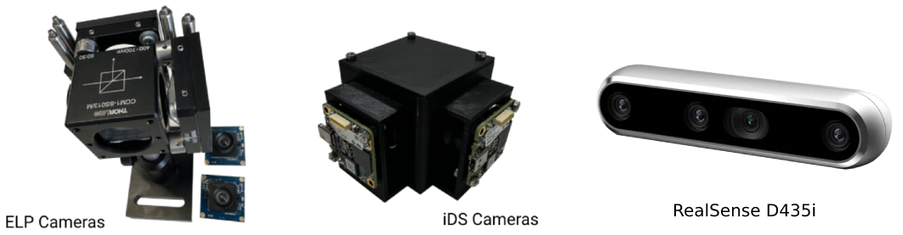

# iMarker Detector Sensor Interfaces



Welcome to the **iMarker Detector Sensor Interfaces** repository 👁️📷!
This module provides clean and modular `Python` interfaces for acquiring visual data from hardware setups specifically designed for iMarker Detection.

## 🧠 About iMarkers

**iMarkers** are invisible fiducial markers detectable only by certain sensors and algorithms. They enable robust detection for human-robot interaction, AR applications, and indoor localization.
Read more about iMarkers (developed for the TRANSCEND project at the [University of Luxembourg](https://www.uni.lu/en/)) in [this link](https://snt-arg.github.io/iMarkers/).

## 📸 Supported Visual Sensors

The current version of the repository supports the cameras listed below. However, it can extend to cover more sensors in the future.

| Camera                                                                   | Interface                | Tested with                                                                                                                                           |
| ------------------------------------------------------------------------ | ------------------------ | ----------------------------------------------------------------------------------------------------------------------------------------------------- |
| [Plug&Play USB Cameras](https://github.com/snt-arg/csr_sensors#usb-cam)  | USB 2.0                  | [ELP-USB8MP02G-L75](http://www.webcamerausb.com/elp-8mp-highdefinition-usb-camera-module-usb20-sony-imx179-color-cmos-sensor-75degree-lens-p-45.html) |
|                                                                          | USB 2.0                  | [MaxMax UV Camera](https://maxmax.com/maincamerapage/uvcameras)                                                                                       |
| [iDS Cameras](https://github.com/snt-arg/csr_sensors#ids-cam)            | USB 3.0 and `uEye+`      | [iDS U3-3271LE-C-HQ Rev.1.2](https://en.ids-imaging.com/store/u3-3271le-rev-1-2.html)                                                                 |
| [intel RealSense Cameras](https://github.com/snt-arg/csr_sensors#rs-cam) | USB 3.0 and `RS library` | [RealSense Depth Camera D435](https://www.intelrealsense.com/depth-camera-d435/)                                                                      |

### 🧰 How to Use Them to Detect iMarkers?

Various hardware designs can be employed to detect iMarkers (and differentiate their CSR-coated regions). In general, these sensors are designed in two variants:

- **A. Dual-vision Sensor Setup:** a homogeneous perception system containing two (synchronized) cameras of the same type (_e.g.,_ two iDS cameras) fixed perpendicular to each other while facing different surfaces of an optical component, _i.e.,_ a beamsplitter.
  - _example_: dual-vision setups designed for [ELP](https://github.com/snt-arg/iMarker_sensors#usb-cam) and [iDS](https://github.com/snt-arg/iMarker_sensors#ids-cam) cameras.
- **B. Single-vision Sensor Setup:** a single camera with a polarizer (fixed or switching) attached to its lens.
  - _example_: single-vision setup using [RealSense](https://github.com/snt-arg/iMarker_sensors#rs-cam).

## 🛠️ Getting Started

Clone the repository:

```bash
git clone https://github.com/snt-arg/iMarker_sensors.git
cd iMarker_sensors/sensors
```

(Optional) Create and activate a virtual environment:

```bash
python -m venv venv
source venv/bin/activate
```

Install the required libraries using the below command:

```bash
pip install -r requirements.txt
# or setup.py by "pip install -e ."
```

This will install all the required dependencies, but to know more about the libraries, check the bullet list below:

#### I. Plug&Play USB Cameras <a id="usb-cam"></a>

Sensors like `ELP` or `MaxMax UV` cameras only require OpenCV (tested with `opencv-python>=4.10`).

#### II. RealSense Cameras <a id="rs-cam"></a>

RealSense cameras need to be connected via **USB 3.0** and require their particular interface, apart from OpenCV (tested with `opencv-python>=4.10` and `pyrealsense2>=2.4`).

#### III. iDS Cameras (Optional) <a id="ids-cam"></a>

If you want to use iDS cameras, you need to **register** in their website and **get access** to install the required libraries provided by the company. iDS cameras should be connected via **USB 3.0** and need **iDS Peak** package and its Python binding introduced in [this link](https://en.ids-imaging.com/download-details/AB03448.html) to be installed. Thus, follow the steps described below:

1. Go to the [downloads](https://en.ids-imaging.com/downloads.html) section of iDS website and search for the camera name (we have tested with a dual-vision setup of `U3-3271LE-C-HQ Rev.1.2`). Choose the proper operating system (Ubuntu, Windows, or Mac) and download the file (without uEye Transport Layer), such as _IDS peak 2.4 for Linux 64-bit - Debian package_.
2. Follow the instructions provided in [this (Ubuntu)](https://en.ids-imaging.com/files/downloads/ids-peak/readme/ids-peak-linux-readme-2.4_EN.html) or [this (Windows)](https://en.ids-imaging.com/files/downloads/ids-peak/readme/ids-peak-windows-readme-2.4_EN.html) links to install the files. As a summary:
   - [Ubuntu] you first need to install libraries using `sudo apt install libqt5core5a libqt5gui5 libqt5widgets5 libqt5quick5 qml-module-qtquick-window2 qml-module-qtquick2 qml-module-qtquick-dialogs qml-module-qtquick-controls qml-module-qtquick-layouts libusb-1.0-0 libqt5multimedia5`. Then, go to the path you downloaded the **ids-peak** file and run `sudo apt install ./ids-peak_[version]_[arch].deb`.
3. Finally, you should add the below Python bindings to make it work. You can also access the binding `whl` files from [this directory](/docs/iDS/). As a sample, the steps to install the libraries are listed below:

- `Windows 64bit` ([link](https://en.ids-imaging.com/files/downloads/ids-peak/readme/ids-peak-windows-readme-2.4_EN.html)):

  - Go to _C:\Program Files\IDS\ids*peak\generic_sdk\api\binding\python\wheel\x86*[32|64]_
  - Choose "File > Open Windows PowerShell" in Windows Explorer.
  - Run: `pip install src/IDS/Windows/ids_peak_ipl-1.6.0.0-cp310-cp310-win_amd64.whl`
  - Run: `pip install src/IDS/Windows/ids_peak-1.5.0.0-cp310-cp310-win_amd64.whl`

- `Windows 32bit` ([link](https://en.ids-imaging.com/files/downloads/ids-peak/readme/ids-peak-windows-readme-2.4_EN.html)):

  - Go to _C:\Program Files\IDS\ids*peak\generic_sdk\api\binding\python\wheel\x86*[32|64]_
  - Choose "File > Open Windows PowerShell" in Windows Explorer.
  - Run: `pip install src/IDS/Windows/ids_peak_ipl-1.6.0.0-cp310-cp310-win32.whl`
  - Run: `pip install src/IDS/Windows/ids_peak-1.5.0.0-cp310-cp310-win32.whl`

- `Linux` ([link](https://en.ids-imaging.com/files/downloads/ids-peak/readme/ids-peak-linux-readme-2.4_EN.html)):
  - Go to `/usr/local/share/ids/bindings/python/wheel/`
  - Run `pip install ids_peak-1.4.3.0-cp38-cp38-linux_x86_64.whl`
  - Run `pip install ids_peak_ipl-1.5.0.0-cp38-cp38-linux_x86_64.whl`

## 📑 Project Structure

The current repository contains easy-to-use functions to fetch the frames from the introduced sensors in the [sensors](/sensors/) directory, described as below:

- Functions to use **Plug&Play USB Cameras** are available in [usb_interface](/sensors/usb_interface.py) file.
- Functions to use **RealSense Cameras** are available in [rs_interface](/sensors/rs_interface.py) file.
- Functions to use **iDS Cameras** are available in [ids_interface](/sensors/ids_interface.py) file.

## 🧪 Example Usage

### I. Run a Plug&Play USB Camera

```python
from sensors import usb_interface as usb

# Fetch the camera
cap = usb.createCameraObject(0)

# Loop
while True:
  # Retrieve frames
  ret, frame = usb.grabImage(cap)

  # Get the parameters
  usb.getCameraParameters(cap)

  # Other codes ...

# Finally
cap.release()
```

### II. Run a RealSense Camera

### III. Run an iDS Camera

```python
from ids_peak import ids_peak
from ids_peak_ipl import ids_peak_ipl
import numpy as np

class idsCamera:
    # class implementation...

def main():
    # Create the camera object
    cap = idsCamera(0)

    # Load camera parameters (optional)
    cap.loadCameraParameters("camera_parameters.cset")

    # Set the region of interest (optional)
    cap.setROI(0, 0, 640, 480)

    # Synchronize the camera as master
    cap.syncAsMaster()

    # Start data acquisition
    cap.startAquisition()

    # Set exposure time (optional)
    cap.setExposureTime(20000)

    while True:
        # Capture a frame
        frame = cap.getFrame()

        # Process the frame...

    # Close the camera and release resources
    cap.closeLibrary()

# Run the program
main()
```

## Calibration

You might need to calibrate the cameras, specially for the dual-vision sensors, if you are using the sensor for the first time. To do this, follow the instructions in the [calibration page](/src/csr_sensors/sensors/calibration/README.md).

## 📎 Related Repositories

It is intended to work in conjunction with the core detection and visualization pipelines:

- 🔍 [iMarker Detector Algorithms](https://github.com/snt-arg/iMarker_algorithms)
- 🖥️ [Standalone GUI-enabled Version of iMarker Detection](https://github.com/snt-arg/iMarker_detector_standalone)
- 🤖 [ROS-enabled Version of iMarker Detection for Advanced Robotics](https://github.com/snt-arg/iMarker_detector_ros)

## 📚 Citation

```bibtex
@article{tourani2025imarkers,
  title={Unveiling the Potential of iMarkers: Invisible Fiducial Markers for Advanced Robotics},
  author={Tourani, A. and Avşar, D.I. and Bavle, H. and Sanchez-Lopez, J.L. and Lagerwall, J.P.F. and Voos, H.},
  journal={IEEE Robotics and Automation Magazine},
  year={2025},
  note={Under Review},
  doi={10.48550/arXiv.2501.15505}
}
```
